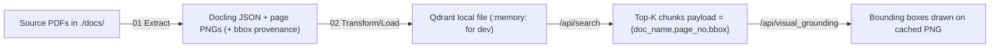

# Medicare Policy Chatbot 📄🧠

A FastAPI‑based **neural search** and **visual‑grounding** service for Medicare
_Summary of Benefits_ (SOB) and _Evidence of Coverage_ (EOC) PDFs with a **Streamlit chat interface**.

<table>
<tr><td>🗂️ Extraction</td><td><b>Docling</b> + SmolDocling‑256M on GPU</td></tr>
<tr><td>🔍 Search</td><td><b>Qdrant</b> hybrid (dense BGE‑small‑en + BM25)</td></tr>
<tr><td>🎯 Grounding</td><td>Bounding‑box payload returned with every hit</td></tr>
<tr><td>💬 Interface</td><td><b>Streamlit</b> chat UI with plan filtering & visual annotations</td></tr>
</table>

---

## Contents

| Folder / file                                                | Purpose                                                                               |
| ------------------------------------------------------------ | ------------------------------------------------------------------------------------- |
| `notebooks/01_extract_medicare_policy_docs.ipynb`            | **GPU** notebook — converts PDFs → Docling JSON + per‑page PNGs (6 min for 206 pages) |
| `notebooks/02_transform_and_load_medicare_policy_docs.ipynb` | **CPU or T4 GPU** — chunks, embeds, and bulk‑loads to local Qdrant, keeping bboxes    |
| `service.py`                                                 | FastAPI server with `/api/search`, `/api/visual_grounding`, `/api/annotate_result`    |
| `streamlit_chat.py`                                          | **Streamlit chat interface** for user-friendly document search                        |
| `hybrid_search.py`                                           | OpenAI embeddings + Qdrant vector search wrapper                                      |
| `embedding.py`                                               | **Alternative** OpenAI embedding script with table extraction fallbacks               |
| `plan_service.py`                                            | Maps plan IDs → SOB / EOC binary hashes                                               |
| `plans.json`                                                 | Declarative list of plans and their document hashes                                   |
| `extracted_docs/`                                            | One `<doc>.json` + `/<doc>/<page>.png` folder per PDF                                 |
| `docs/`                                                      | Contains the original source PDF documents for Medicare plans                         |
| `requirements.txt`                                           | Pinned versions (`docling 0.28.2`, `qdrant-client[fastembed-gpu]`, `fastapi`, …)      |

---

## Pipeline Overview



- **Docling settings**
  `generate_page_images=True`, `image_mode=REFERENCED`, and
  `res.document.export_figures()` write lean JSON + external PNGs.

- **Chunker**
  `HybridChunker` (\~200 tokens) keeps layout coherence.

- **Dense model (OpenAI)**
  `text-embedding-3-small` (1536‑d) via OpenAI API.

- **Table extraction**
  Documents with 0 text items (table‑heavy) use table markdown export or document markdown as fallback.

- **Bounding boxes**
  Normalised `[l,t,r,b]` (0‑1) stored in payload → drawn in `/api/annotate_result`.

---

## Quickstart

### 0 · Prereqs

- Python 3.10+
- GPU optional (T4 gives 3× faster embeddings)

### 1 · Clone & env

```bash
git clone https://github.com/jharkins/medicare-policy-chatbot.git
cd medicare-policy-chatbot
python -m venv venv && source venv/bin/activate
pip install -r requirements.txt
```

### 2 · Run the notebooks (one‑time ETL)

| Notebook                                       | Runtime type  | What it does                                                       |
| ---------------------------------------------- | ------------- | ------------------------------------------------------------------ |
| **01_extract_medicare_policy_docs**            | GPU (T4/A100) | Processes PDFs from `docs/` ➜ converts to JSON + PNGs              |
| **02_transform_and_load_medicare_policy_docs** | CPU / GPU     | Chunks extracted data ➜ `client.add()` to Qdrant with bbox payload |

Both notebooks are re‑entrant; rerun any time new PDFs arrive.

### 3 · FastAPI server

```bash
uvicorn service:app --reload
```

Swagger UI: [http://localhost:8000/docs](http://localhost:8000/docs)

### 4 · Streamlit Chat Interface

```bash
streamlit run streamlit_chat.py
```

Chat UI: [http://localhost:8501](http://localhost:8501)

Environment variables (copy from `env.sample` to `.env`):

```bash
export QDRANT_URL=":memory:" # or "http://localhost:6333" for a persistent instance
export QDRANT_API_KEY="" # (if your Qdrant instance requires an API key)
export EMBED_MODEL_ID="sentence-transformers/all-MiniLM-L6-v2" # (legacy, not used with OpenAI)
export SPARSE_MODEL_ID="Qdrant/bm25" # (legacy, not used with OpenAI)
export COLLECTION="medicare_policy_docs"
export OPENAI_API_KEY="your-openai-api-key-here" # Required for embeddings
```

These can be set in your shell or by creating a `.env` file in the project root (see `env.sample`).

### 5 · Running with Docker

This assumes you have already run the ETL notebooks (see step 2) to populate your Qdrant instance and generate the `extracted_docs/` directory.

1.  **Build the Docker Image:**

    ```bash
    docker build -t medicare-policy-chatbot .
    ```

2.  **Prepare your `.env` file:**
    Create a file named `.env` in the project root with the following content, adjusting values for your Qdrant setup:

    ```env
    # Required: Point this to your running Qdrant instance
    QDRANT_URL=http://localhost:6333

    # Required if your Qdrant instance uses an API key
    QDRANT_API_KEY=

    # Required: OpenAI API key for embeddings
    OPENAI_API_KEY=your-openai-api-key-here

    # Optional: These are defaulted but can be overridden if needed
    # EMBED_MODEL_ID=sentence-transformers/all-MiniLM-L6-v2
    # SPARSE_MODEL_ID=Qdrant/bm25
    # COLLECTION=medicare_policy_docs
    ```

3.  **Run the Docker Container:**
    Replace `/path/to/your/medicare-policy-chatbot/extracted_docs` with the absolute path to the `extracted_docs` directory on your host machine.

    **FastAPI only (default):**
    ```bash
    docker run -d -p 8000:8000 \
      --env-file ./.env \
      -v /path/to/your/medicare-policy-chatbot/extracted_docs:/app/extracted_docs \
      --name medicare-chatbot-api \
      medicare-policy-chatbot
    ```
    Access: `http://localhost:8000` (Swagger UI: `http://localhost:8000/docs`)

    **Streamlit chat interface only:**
    ```bash
    docker run -d -p 8501:8501 \
      --env-file ./.env \
      -e SERVICE=streamlit \
      -v /path/to/your/medicare-policy-chatbot/extracted_docs:/app/extracted_docs \
      --name medicare-chatbot-ui \
      medicare-policy-chatbot
    ```
    Access: `http://localhost:8501`

    **Both services:**
    ```bash
    docker run -d -p 8000:8000 -p 8501:8501 \
      --env-file ./.env \
      -e SERVICE=both \
      -v /path/to/your/medicare-policy-chatbot/extracted_docs:/app/extracted_docs \
      --name medicare-chatbot-full \
      medicare-policy-chatbot
    ```
    Access: API at `http://localhost:8000`, Chat at `http://localhost:8501`

---

## Core Endpoints

| Method & Path                                       | Purpose                       |
| --------------------------------------------------- | ----------------------------- |
| **GET /api/plans**                                  | list loaded plans & hashes    |
| **GET /api/search** `?q=`                           | top‑K hybrid search chunks    |
| **GET /api/visual_grounding** <br>`?q=&plan_id=&k=` | same as search + bbox payload |
| **POST /api/annotate_result**                       | JSON → PNG with rectangles    |

Bounding‑box array is always normalised; front‑end multiplies by displayed img w/h.

---

## Performance Notes

| Stage                | Free CPU                 | T4 GPU                  |
| -------------------- | ------------------------ | ----------------------- |
| Docling extraction   | ❌ (slow)                | ✅ (~6 min / 200 pages) |
| OpenAI embeddings    | ✅ (API-based)           | ✅ (API-based)          |
| Qdrant query         | ✅                       | ✅                      |
| Streamlit interface  | ✅                       | ✅                      |

---

## Contributing

1. Fork → `git checkout -b feature/...` → PR
2. Run `ruff check .` and `pytest` before pushing.
3. Large PDFs? Test in `:memory:` then point to real Qdrant.

---

## License

MIT © BitStorm Technologies
